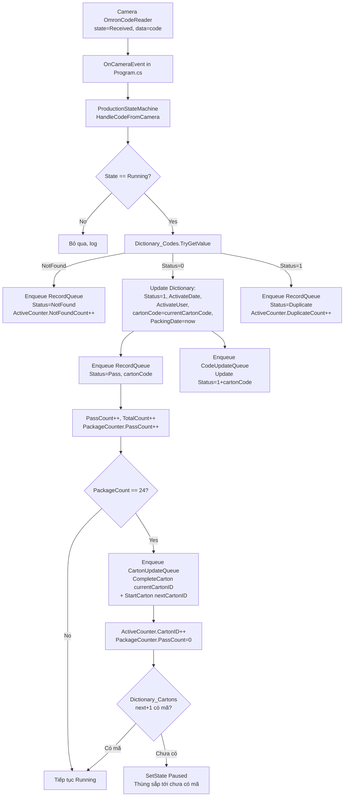
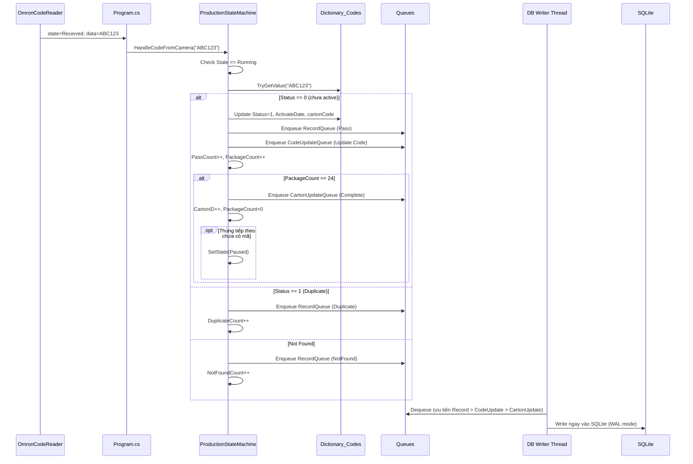
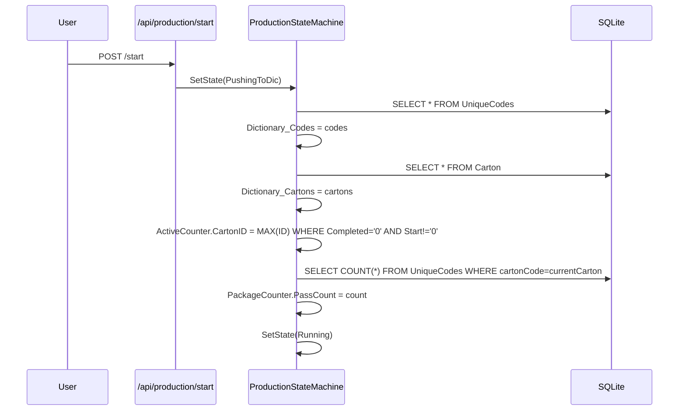

# Plan: Triển khai luồng xử lý 1 camera

## Mục tiêu

Khi camera quét được mã, app tự động: tra `Dictionary_Codes` O(1) -> đánh dấu activate trong RAM -> **ngay lập tức** enqueue ghi `Record` + ghi `UpdateCode` vào DB -> pack vào thùng hiện tại. Khi đủ 24 sản phẩm mới enqueue ghi `CompleteCarton` và tăng cartonID. Background consumer thread duy nhất serialize ghi SQLite. Khi restart (mất điện), `ProcessPushToDic` sẽ reload codes + trạng thái carton từ DB để phục hồi đúng vị trí đang chạy.

## Cơ chế ghi DB theo yêu cầu


| Loại                             | Thời điểm ghi DB                  | Mục đích                         |
| -------------------------------- | --------------------------------- | -------------------------------- |
| `Record_{orderNo}.db`            | Ngay khi nhận mã (mỗi mã = 1 row) | Audit, biết mã nào đã qua camera |
| `{orderNo}.db` (UniqueCodes)     | Ngay khi nhận mã                  | Cập nhật Status=1 + cartonCode   |
| `Carton_{orderNo}.db` (Complete) | Chỉ khi đủ 24 mã trong thùng      | Đóng thùng, tăng cartonID        |


Cả 3 đều đi qua queue để tránh race condition khi camera quét nhanh.

## Sơ đồ luồng




## Sơ đồ Background Consumer (1 thread duy nhất)

```mermaid
flowchart LR
    A[RecordQueue<br/>ghi ngay] --> C[Consumer Thread<br/>loop mỗi 5-20ms]
    B[CodeUpdateQueue<br/>ghi ngay] --> C
    D[CartonUpdateQueue<br/>chỉ khi đủ 24] --> C
    C --> E[Switch theo task type]
    E --> F[Write {orderNo}.db<br/>Record_{orderNo}.db<br/>Carton_{orderNo}.db]
```


## Sơ đồ reload khi Start (mất điện / restart)

```mermaid
flowchart TD
    A[User gọi /api/production/start] --> B[ProductionData = POInfo]
    B --> C[ProcessPushToDicState]
    C --> D[Load codes từ {orderNo}.db<br/>vào Dictionary_Codes]
    D --> E[Load cartons từ Carton_{orderNo}.db<br/>vào Dictionary_Cartons]
    E --> F[Tính ActiveCounter.CartonID<br/>= MAX cartonID chưa Completed_Datetime]
    F --> G[PackageCounter.PassCount<br/>= COUNT codes đã pack trong cartonID hiện tại]
    G --> H[SetState Running]
    H --> I{Tổng đã activate + 24 > orderQty?}
    I -- Yes --> J[Cảnh báo sắp đủ PO]
```


## Thay đổi chi tiết

### 1. [GProject/Production/ProductionStateMachine.cs](GProject/Production/ProductionStateMachine.cs)

**Sửa bug `ProcessLoadPOState` (dòng 366-383)** — copy từ Dictionary tạm sang ConcurrentDictionary:

```csharp
var temp = new Dictionary<string, CodeInfo>();
GProduction.CodeDictionaryLoader.LoadAllCodesToDictionary(ProductionData.OrderNo, temp);
Dictionary_Codes.Clear();
foreach (var kv in temp) Dictionary_Codes[kv.Key] = kv.Value;
```

**Sửa `ProcessPushToDicState` (dòng 388-443)** để reload đầy đủ trạng thái đã chạy trước đó (dùng pattern MASAN `Pushing_continue_PO_to_PLC`):

- Load codes từ `{orderNo}.db` (giống cũ — đã có sẵn)
- Load cartons từ `Carton_{orderNo}.db` (giống cũ — đã có sẵn)
- **Mới**: tính lại `ActiveCounter.CartonID`:

```csharp
  // Tìm cartonID đang chạy dở (Completed_Datetime = '0' nhưng có Start_Datetime != '0')
  var lastRunning = Dictionary_Cartons.Values
      .Where(c => c.StartDatetime != "0" && c.CompletedDatetime == "0")
      .OrderBy(c => c.Id)
      .FirstOrDefault();
  ActiveCounter.CartonID = lastRunning?.Id ?? 1;
  

```

- **Mới**: tính lại `PackageCounter.PassCount`:

```csharp
  PackageCounter.PassCount = GProduction.PORecord.GetCodeCountInCarton(
      ProductionData.OrderNo, ActiveCounter.CartonCode);
  

```

  (Đếm các code đã pack trong carton hiện tại từ DB)

- Load lại `ActiveCounter.PassCount`, `ActiveCounter.FailCount`, `ActiveCounter.DuplicateCount` từ Record DB (nếu cần — optional, có thể reset về 0 cũng được vì logic pause sẽ tự điều chỉnh)

**Thêm 3 ConcurrentQueue + consumer thread**:

```csharp
public ConcurrentQueue<RecordData> RecordQueue { get; } = new();
public ConcurrentQueue<CodeUpdateItem> CodeUpdateQueue { get; } = new();
public ConcurrentQueue<CartonUpdateItem> CartonUpdateQueue { get; } = new();

private CancellationTokenSource? _writerCts;
private Task? _writerTask;

private void StartDbWriter()
{
    _writerCts = new CancellationTokenSource();
    _writerTask = Task.Run(() => DbWriterLoop(_writerCts.Token));
}

private async Task DbWriterLoop(CancellationToken ct)
{
    while (!ct.IsCancellationRequested)
    {
        try
        {
            // Ưu tiên ghi Record trước (audit)
            if (RecordQueue.TryDequeue(out var rec))
                GProduction.PORecordHelper.Record(ProductionData.OrderNo, rec);
            else if (CodeUpdateQueue.TryDequeue(out var codeUpd))
                GProduction.PORecordHelper.UpdateCodeStatusAndCarton(...)
            else if (CartonUpdateQueue.TryDequeue(out var cartUpd))
                GProduction.POCarton.CompleteCarton(...)
            else
                await Task.Delay(5, ct);
        }
        catch (Exception ex)
        {
            Log.Error(ex, "[DB Writer] error");
        }
    }
}
```

**Thêm method `HandleCodeFromCamera(string code)`**:

```csharp
public void HandleCodeFromCamera(string code)
{
    // Chuẩn hóa code (giống MASAN)
    code = code?.Trim();
    if (string.IsNullOrEmpty(code) || code == "FAIL")
    {
        ActiveCounter.ReadFailCount++;
        RecordQueue.Enqueue(new RecordData { Status = "FAIL", ... });
        return;
    }
    code = code.Replace("<GS>", "\u001D").Replace("<RS>", "\u001E").Replace("<US>", "\u001F");

    if (CurrentState != e_ProductionState.Running) return;

    lock (_stateLock)
    {
        ActiveCounter.TotalCount++;

        if (!Dictionary_Codes.TryGetValue(code, out var info))
        {
            ActiveCounter.NotFoundCount++;
            RecordQueue.Enqueue(new RecordData { Code = code, Status = "NotFound", ... });
            return;
        }

        if (info.Status == 1) // đã active -> Duplicate
        {
            ActiveCounter.DuplicateCount++;
            RecordQueue.Enqueue(new RecordData { Code = code, Status = "Duplicate", ... });
            return;
        }

        // Lấy cartonCode hiện tại từ Dictionary_Cartons
        string currentCartonCode = "0";
        if (Dictionary_Cartons.TryGetValue(ActiveCounter.CartonID, out var carton))
            currentCartonCode = carton.CartonCode;

        // Check: nếu thùng hiện tại chưa có mã -> Reject (ghi Error record)
        if (currentCartonCode == "0")
        {
            ActiveCounter.FailCount++;
            RecordQueue.Enqueue(new RecordData { Code = code, Status = "Error", ... });
            return;
        }

        // Update Dictionary ngay (RAM)
        info.Status = 1;
        info.ActivateDate = DateTime.Now.ToString("yyyy-MM-dd HH:mm:ss");
        info.ActivateUser = "<API>";
        info.CartonCode = currentCartonCode;
        info.PackingDate = info.ActivateDate;
        Dictionary_Codes[code] = info;

        // Ghi Record ngay
        RecordQueue.Enqueue(new RecordData
        {
            Code = code,
            CartonCode = currentCartonCode,
            Status = "Pass",
            ActivateDate = info.ActivateDate,
            ActivateUser = info.ActivateUser,
            PackingDate = info.PackingDate,
            ProductionDate = ProductionData.ProductionDate
        });

        // Ghi CodeUpdate ngay (update UniqueCodes)
        CodeUpdateQueue.Enqueue(new CodeUpdateItem { ... });

        ActiveCounter.PassCount++;
        PackageCounter.PassCount++;

        // Đủ 24 mới enqueue CompleteCarton + StartCarton next
        if (PackageCounter.PassCount >= ActiveCounter.CartonCapacity)
        {
            int currentCartonID = ActiveCounter.CartonID;
            CartonUpdateQueue.Enqueue(new CartonUpdateItem
            {
                Type = CartonUpdateType.Complete,
                CartonID = currentCartonID
            });
            // Tăng cartonID ngay trong RAM
            ActiveCounter.CartonID++;
            PackageCounter.PassCount = 0;

            // Check thùng tiếp theo
            if (Dictionary_Cartons.TryGetValue(ActiveCounter.CartonID, out var nextCarton)
                && nextCarton.CartonCode == "0")
            {
                LastWarning = "Thùng sắp tới chưa có mã";
                SetState(e_ProductionState.Paused, LastWarning);
                return;
            }
        }

        // Đạt orderQty -> chuyển WaitingStop
        if (ActiveCounter.PassCount >= ProductionData.OrderQty)
            SetState(e_ProductionState.WaitingStop, "orderQty reached");
    }
}
```

**Trong `Start()`**: gọi `StartDbWriter()`.
**Trong `StopAsync()`**: gọi `StopDbWriter()` (cancel token, await task).
**Trong `ResetForLogout()`**: clear 3 queue.

### 2. [GProject/Program.cs](GProject/Program.cs)

Sửa `OnCameraEvent` (dòng 120-132) trong `case eOmronCodeReaderState.Received:`:

```csharp
case eOmronCodeReaderState.Received:
    Log.Information("[Camera] Received: {Data}", data);
    _ = CameraHub.Instance.BroadcastAsync(camera, state, data);
    ProductionStateMachine.Instance.HandleCodeFromCamera(data);
    break;
```

### 3. [GProject/ProductionOrderHelpers/PORecord.cs](GProject/ProductionOrderHelpers/PORecord.cs)

Thêm method `UpdateCodeStatusAndCarton(orderNo, code, activateDate, activateUser, packingDate, cartonCode, productionDate)`:

```csharp
public static Result UpdateCodeStatusAndCarton(string orderNo, string code, string activateDate, string activateUser, string packingDate, string cartonCode, string productionDate)
{
    // UPDATE UniqueCodes SET Status=1, ActivateDate, ActivateUser, cartonCode, PackingDate, ProductionDate WHERE Code=?
    const string sql = @"UPDATE UniqueCodes SET Status=1, ActivateDate=COALESCE(NULLIF(@ActivateDate,''), ActivateDate), ActivateUser=COALESCE(NULLIF(@ActivateUser,''), ActivateUser), PackingDate=COALESCE(NULLIF(@PackingDate,''), PackingDate), cartonCode=@cartonCode, ProductionDate=COALESCE(NULLIF(@ProductionDate,''), ProductionDate) WHERE Code=@Code;";
    // ... execute
}
```

### 4. [GProject/ProductionOrderHelpers/GProduction.cs](GProject/ProductionOrderHelpers/GProduction.cs)

Thêm wrapper:

```csharp
public static Result UpdateCodeStatusAndCarton(string orderNo, string code, string activateDate, string activateUser, string packingDate, string cartonCode, string productionDate)
    => ProductionOrderHelpers.PORecord.UpdateCodeStatusAndCarton(...);
```

### 5. [GProject/ProductionOrderHelpers/Models.cs](GProject/ProductionOrderHelpers/Models.cs)

Thêm 3 internal class:

```csharp
public class CodeUpdateItem { public string OrderNo, Code, ActivateDate, ActivateUser, PackingDate, CartonCode, ProductionDate; }
public enum CartonUpdateType { Complete }
public class CartonUpdateItem { public CartonUpdateType Type; public int CartonID; }
```

## Đảm bảo an toàn dữ liệu

- **Thread-safety**:
  - `lock(_stateLock)` cho mọi thao tác trên `Dictionary_Codes`, `Dictionary_Cartons`, `ActiveCounter`, `PackageCounter`
  - 3 `ConcurrentQueue` an toàn cho multi-producer
  - Consumer thread single-thread, không cần lock khi dequeue
- **Crash recovery**:
  - Record/CodeUpdate ghi ngay khi nhận mã → restart vẫn reload được đầy đủ qua `ProcessPushToDicState`
  - CartonComplete đã buffered trong queue → nếu mất điện trước khi ghi, lúc reload sẽ detect `Completed_Datetime = '0'` ở carton hiện tại, tính lại `cartonID` đúng vị trí
  - `PackageCounter.PassCount` được reset = COUNT mã đã pack trong carton hiện tại (lấy từ DB) → đảm bảo không đếm lại mã đã pack
- **WAL mode** đã bật sẵn → concurrent read/write OK
- **Queue size**: nếu queue quá lớn (>10000 items) → cảnh báo log; trong trường hợp thường < 24 items (consumer real-time)

## Sequence xử lý 1 mã




## Sequence reload khi restart




## Trình tự implement

1. Thêm `UpdateCodeStatusAndCarton` trong PORecord.cs + wrapper trong GProduction.cs
2. Thêm 3 internal class trong Models.cs
3. Sửa `ProcessLoadPOState` (copy Dictionary) trong ProductionStateMachine.cs
4. Sửa `ProcessPushToDicState` (reload cartonID + PackageCount) trong ProductionStateMachine.cs
5. Thêm 3 ConcurrentQueue + consumer thread trong ProductionStateMachine.cs (StartDbWriter/StopDbWriter)
6. Thêm method `HandleCodeFromCamera` trong ProductionStateMachine.cs
7. Sửa `OnCameraEvent` trong Program.cs (case Received)
8. Test thủ công

## File cần thay đổi

- [GProject/Production/ProductionStateMachine.cs](GProject/Production/ProductionStateMachine.cs) - sửa ProcessLoadPOState + ProcessPushToDicState, thêm queue, consumer, HandleCodeFromCamera
- [GProject/Program.cs](GProject/Program.cs) - sửa OnCameraEvent case Received
- [GProject/ProductionOrderHelpers/PORecord.cs](GProject/ProductionOrderHelpers/PORecord.cs) - thêm UpdateCodeStatusAndCarton
- [GProject/ProductionOrderHelpers/GProduction.cs](GProject/ProductionOrderHelpers/GProduction.cs) - thêm wrapper
- [GProject/ProductionOrderHelpers/Models.cs](GProject/ProductionOrderHelpers/Models.cs) - thêm 3 internal class

## Test thủ công

### Test 1: Happy path

1. Tạo PO mới (API `/api/po`) orderQty=100, gtin=ABC
2. Select PO -> CheckPO -> LoadPO -> Ready -> Start
3. State = Running, ActiveCounter.CartonID=1, PackageCounter.PassCount=0
4. Quét 24 mã qua camera
5. Verify:
  - `{orderNo}.db`: 24 mã đầu có `Status=1, cartonCode=<caronID1 code>`
  - `Record_{orderNo}.db`: 24 record Status="Pass"
  - `Carton_{orderNo}.db`: carton ID 1 có `Completed_Datetime != '0'`
  - Dictionary_Cartons[1].CompletedDatetime được cập nhật trong RAM
  - ActiveCounter.CartonID=2, PackageCounter.PassCount=0
  - Nếu thùng 2 chưa có mã → SetState(Paused)
6. Quét mã thùng mới qua PDA `/api/carton/scan`
7. State → Running
8. Quét tiếp 24 mã → carton 2 đóng → lặp lại
9. Khi đủ orderQty → SetState(WaitingStop) → Stop → Completed

### Test 2: Crash recovery

1. Chạy PO, quét ~15 mã (thùng 1 chưa đủ 24)
2. Force kill app
3. Mở lại app, login, gọi `/api/production/select-po` + `/api/production/start`
4. Verify:
  - ProcessPushToDicState reload codes
  - ProcessPushToDicState reload cartons
  - ActiveCounter.CartonID = 1 (carton đang chạy dở)
  - PackageCounter.PassCount = 15 (count từ DB)
5. Quét tiếp mã thứ 16 → PassCount = 16, PackageCount = 16 → không đóng thùng (chỉ đóng khi đủ 24)

### Test 3: Duplicate

1. Sau khi đã có 1 mã đã active (Status=1)
2. Quét lại mã đó
3. Verify:
  - Dictionary_Codes[mã].Status vẫn = 1
  - RecordQueue có 1 item Status="Duplicate"
  - ActiveCounter.DuplicateCount++
  - KHÔNG tăng PackageCounter.PassCount
  - KHÔNG pack lại (cartonCode giữ nguyên)

### Test 4: NotFound

1. Gửi mã không có trong DataPool
2. Verify:
  - RecordQueue có 1 item Status="NotFound"
  - ActiveCounter.NotFoundCount++
  - Dictionary_Codes không có entry này

## Lưu ý quan trọng

- "Ghi ngay khi nhận mã" áp dụng cho Record + CodeUpdate, CartonComplete thì đợi đủ 24
- Khi reload, `ActiveCounter.PassCount` tính từ `Dictionary_Codes.Values.Count(c => c.Status == 1)`, hoặc đơn giản để = 0 (vì quan trọng là cartonID + PackageCount mới quyết định tiếp tục)
- Thùng tiếp theo chưa có mã → Pause → user scan PDA → chuyển về Running
- Background consumer ưu tiên ghi Record trước (audit quan trọng nhất), rồi CodeUpdate, rồi CartonUpdate
- Comment vào code bằng tiếng việt.

