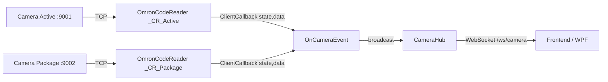

# Kế hoạch: Camera setup + WebSocket server broadcast

## Bối cảnh
- Hiện tại `GProject/Program.cs` đã khai báo `_CR_Active` và `_CR_Package` (dòng 12-13) nhưng **chưa khởi tạo**, chưa `Connect()`, chưa đăng ký `ClientCallback`, và chưa có WebSocket server.
- `OmronCodeReader` (ở `Glib/CodeReader/OmronCodeReader.cs`) đã hỗ trợ sẵn:
  - Constructor `(e_CodeReaderModel model, string ip, int port)`
  - `Connect()` (tự ping + reconnect ngầm)
  - Event `ClientCallback(eOmronCodeReaderState state, string data)` — bắn ra 4 trạng thái: `Connected`, `Disconnected`, `Received`, `Reconnecting`.
- `GProject` project dùng SDK `Microsoft.NET.Sdk.Web` (`GProject/GProject.csproj:1`) — sẵn WebSocket middleware.

## File chỉnh sửa / tạo mới

### 1. `GProject/CameraHub.cs` (tạo mới)
Singleton hub quản lý danh sách client WebSocket đang kết nối và gửi message broadcast.

```csharp
using System.Collections.Concurrent;
using System.Net.WebSockets;
using System.Text;
using System.Text.Json;
using Glib.Omron;

namespace GProject;

public class CameraHub
{
    public static readonly CameraHub Instance = new();
    private readonly ConcurrentDictionary<Guid, WebSocket> _clients = new();

    public void Register(WebSocket ws) => _clients[Guid.NewGuid()] = ws;
    public void Unregister(WebSocket ws)
    {
        foreach (var kv in _clients.Where(kv => kv.Value == ws).ToList())
            _clients.TryRemove(kv.Key, out _);
    }

    public async Task BroadcastAsync(string camera, eOmronCodeReaderState state, string data)
    {
        var payload = JsonSerializer.Serialize(new {
            camera, state = state.ToString(), data, at = DateTime.UtcNow
        });
        var bytes = Encoding.UTF8.GetBytes(payload);
        var seg = new ArraySegment<byte>(bytes);
        foreach (var ws in _clients.Values.Where(c => c.State == WebSocketState.Open))
        {
            try { await ws.SendAsync(seg, WebSocketMessageType.Text, true, CancellationToken.None); }
            catch { /* client ngắt */ }
        }
    }
}
```

### 2. `GProject/Program.cs` (sửa)
Sau block khởi tạo `ProductionStateMachine` (sau dòng 65), thêm:

```csharp
// Khởi tạo 2 camera (active + package)
_CR_Active = new OmronCodeReader(OmronCodeReader.e_CodeReaderModel.V430, "127.0.0.1", 9001);
_CR_Package = new OmronCodeReader(OmronCodeReader.e_CodeReaderModel.V430, "127.0.0.1", 9002);

void OnCameraEvent(string camera, eOmronCodeReaderState state, string data)
{
    Log.Information("[Camera:{Camera}] [{State}] {Data}", camera, state, data);
    _ = CameraHub.Instance.BroadcastAsync(camera, state, data);
}

_CR_Active.ClientCallback += (s, d) => OnCameraEvent("active", s, d);
_CR_Package.ClientCallback += (s, d) => OnCameraEvent("package", s, d);

_CR_Active.Connect();
_CR_Package.Connect();
Log.Information("[Main] Cameras initialized: active=127.0.0.1:9001, package=127.0.0.1:9002");
```

Trong `finally` (trước `Log.CloseAndFlush()`) thêm cleanup:
```csharp
try { _CR_Active?.Disconnect(); } catch { }
try { _CR_Package?.Disconnect(); } catch { }
```

### 3. `GProject/GProjectApiServer.cs` (sửa)
Trong `StartAsync()`, sau dòng `_app.UseCors();` thêm WebSocket middleware và map endpoint `/ws/camera`:

```csharp
var webSocketOptions = new WebSocketOptions { KeepAliveInterval = TimeSpan.FromSeconds(30) };
_app.UseWebSockets(webSocketOptions);

_app.Map("/ws/camera", async context =>
{
    if (!context.WebSockets.IsWebSocketRequest)
    {
        context.Response.StatusCode = 400;
        return;
    }
    using var ws = await context.WebSockets.AcceptWebSocketAsync();
    CameraHub.Instance.Register(ws);
    var buf = new byte[1024];
    while (ws.State == WebSocketState.Open)
    {
        var res = await ws.ReceiveAsync(new ArraySegment<byte>(buf), CancellationToken.None);
        if (res.MessageType == WebSocketMessageType.Close)
            break;
    }
    CameraHub.Instance.Unregister(ws);
    await ws.CloseAsync(WebSocketCloseStatus.NormalClosure, "bye", CancellationToken.None);
});
```

(Lưu ý: `Map` raw delegate phải được đặt **sau** `UseWebSockets` và **trước** khi auth middleware chặn — hiện tại auth middleware đang ở dòng 63, _trước_ `UseCors`. Sẽ chèn WebSocket route ở dưới auth (chấp nhận không yêu cầu đăng nhập) hoặc có thể loại trừ path trong AuthMiddleware.)

## Luồng dữ liệu



## Định dạng message broadcast
JSON mỗi lần camera thay đổi trạng thái hoặc quét được code:
```json
{ "camera": "active",  "state": "Received", "data": "ABC123", "at": "2026-07-03T16:30:00Z" }
{ "camera": "package", "state": "Connected", "data": "Connected successfully", "at": "..." }
```

## Test thủ công sau khi cài
1. `dotnet build GProject`
2. Chạy GProject, quan sát log `[Camera:active] [Reconnecting] Attempting to reconnect...` (vì không có camera thật).
3. Dùng `wscat -c ws://localhost:9999/ws/camera` hoặc client nhỏ để subscribe.
4. Bật TCP listener giả trên port 9001/9002 (ví dụ `nc -l 9001`) rồi gõ code — sẽ thấy message broadcast tới ws client.

## Ngoài phạm vi (sẽ không làm)
- Không thêm auth cho WebSocket (giữ đơn giản như yêu cầu).
- Không tự động tạo config file — IP/port hardcode theo lựa chọn của bạn.
- Không đổi ProductionStateMachine để xử lý `data` nhận được (chỉ forward, tích hợp state machine là việc khác).
