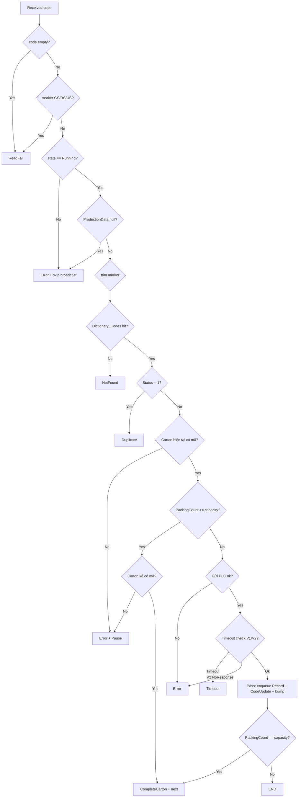

## Mục tiêu

Hai plan cần hợp nhất trong cùng 1 lần triển khai:

1. **Luồng CameraSub trong GProject**: `ProductionStateMachine.HandleCodeFromCamera` (`GProject/Production/ProductionStateMachine.cs:307`) hiện chỉ có 4 nhánh (Pass/Duplicate/NotFound/Fail). Cần mở rộng thành pipeline 11 nhánh giống [`FDashboard.cs`](d:\DuAn\MASANSolution\MASAN-SERIALIZATION\Views\Dashboards\FDashboard.cs:454) `CameraSub_Process`: trạng thái line, mã rỗng/FAIL/marker, NotFound, Duplicate, thùng hiện tại/kế chưa có mã, timeout, gửi PLC.
2. **SCADA UI broadcast (Backend)**: `CameraHub.cs` (`GProject/CameraHub.cs`) hiện chỉ broadcast thô. Cần thêm: enum `e_Production_Status`, ring buffer 100 mã gần nhất, broadcast event `CodeScanned` có kèm `status`, REST `/api/camera-history`.

FE types trong `iot-scada-admin-panel/src/types/camera.ts` được mở rộng để tương thích ngược (`CameraEventMessage` giữ nguyên, thêm `CameraCodeStatusMessage`).

## Phạm vi & nguyên tắc

- 1 camera làm cả 2 việc (active + phân làn) — giữ nguyên cấu hình hiện tại (`Program.cs:67-71`).
- Kế thừa `ActiveCounter`/`Dictionary_Codes`/`Dictionary_Cartons` đã có trong `ProductionStateMachine`.
- Enum đặt tên `e_Production_Status` (giống MASAN, snake_case Pascal để khớp convention của dự án).
- Không sửa `OmronCodeReader.cs` — chỉ có 4 state kết nối, đủ dùng.
- Không thêm queue mới ở DB writer — chỉ thêm 1 ring buffer (in-memory) cho `/api/camera-history`.
- Tất cả thay đổi tương thích ngược với FE hiện tại (giữ `camera`/`state`/`data`/`at` trong payload cũ).

## File sẽ sửa

- `GProject/CameraHub.cs` — thêm `e_Production_Status` + `CameraReadResult` + `CameraHistoryEntry` + ring buffer + `BroadcastCodeStatus` + `GetHistory`.
- `GProject/Production/ProductionStateMachine.cs` — `HandleCodeFromCamera` đổi return `CameraReadResult?`; thêm `PeekLastCodeStatus`; thêm `TimeoutCount` vào counter.
- `GProject/Program.cs` — `OnCameraEvent` wire `BroadcastCodeStatus` + `RecordHistory`.
- `GProject/Controllers/CameraHistoryController.cs` (tạo mới) — REST `/api/camera-history?limit=200`.
- `iot-scada-admin-panel/src/types/camera.ts` — mở rộng `CameraState` + thêm `CameraCodeStatusMessage`.

## File KHÔNG đụng (theo plan SCADA đã có TODO riêng)

- `iot-scada-admin-panel/src/App.tsx` — sẽ làm trong plan SCADA frontend TODO `fe-deviceindicator`, `fe-grid-2x2`, `fe-history-tab`, `fe-badge-status` (đã liệt kê, status pending).
- `Glib/CodeReader/OmronCodeReader.cs`.
- `GProject/ProductionHub.cs`, `GProjectApiServer.cs` (không liên quan).

## Bước triển khai

### 1. Mở rộng `CameraHub.cs`

Thay thế toàn bộ nội bằng:

```csharp
using System.Collections.Concurrent;
using System.Net.WebSockets;
using System.Text;
using System.Text.Json;
using Glib.Omron;

namespace GProject;

public enum e_Production_Status
{
    Pass, Fail, Duplicate, NotFound, Error, ReadFail, Timeout
}

public record CameraReadResult(
    string Camera, string Code, e_Production_Status Status,
    bool PlcSent, string? CartonCode, int? CartonId, DateTime At);

public record CameraHistoryEntry(
    long Id, DateTime At, string Code, e_Production_Status Status,
    string? CartonCode, int? CartonId);

public class CameraHub
{
    public static readonly CameraHub Instance = new();

    private readonly ConcurrentDictionary<Guid, WebSocket> _clients = new();
    private readonly object _registerLock = new();
    private const int HistoryCapacity = 200;
    private readonly ConcurrentQueue<CameraHistoryEntry> _history = new();
    private long _historySeq;

    // Register / Unregister / ClientCount: giữ nguyên.
    public void Register(WebSocket ws) { ... }
    public void Unregister(WebSocket ws) { ... }
    public int ClientCount => _clients.Count;

    public void RecordHistory(CameraReadResult r)
    {
        var entry = new CameraHistoryEntry(
            Interlocked.Increment(ref _historySeq),
            r.At, r.Code, r.Status, r.CartonCode, r.CartonId);
        _history.Enqueue(entry);
        while (_history.Count > HistoryCapacity && _history.TryDequeue(out _)) { }
    }

    public IReadOnlyList<CameraHistoryEntry> GetHistory(int limit)
    {
        var all = _history.ToArray();
        return limit >= all.Length ? all : all[^limit..];
    }

    // Giữ nguyên cho connection event (Connected/Disconnected/Received/Reconnecting).
    public async Task BroadcastAsync(string camera, eOmronCodeReaderState state, string data) { ... }

    // Mới: event "CodeScanned" có kèm status để FE render badge.
    public async Task BroadcastCodeStatus(CameraReadResult r)
    {
        var payload = JsonSerializer.Serialize(new
        {
            camera = r.Camera,
            state = "CodeScanned",
            data = r.Code,
            status = r.Status.ToString(),
            plcSent = r.PlcSent,
            cartonCode = r.CartonCode,
            cartonId = r.CartonId,
            at = r.At
        });
        await SendAsync(payload);
    }

    private async Task SendAsync(string json) { /* share với BroadcastAsync */ }
    private Guid FindKey(WebSocket ws) { ... }
}
```

`BroadcastAsync` cũ vẫn được gọi cho state kết nối; `BroadcastCodeStatus` mới chỉ được gọi khi có mã thực sự quét.

### 2. Mở rộng `ProductionStateMachine.HandleCodeFromCamera`

Tại `GProject/Production/ProductionStateMachine.cs:307` — đổi signature, tách 11 nhánh:

```csharp
public CameraReadResult? HandleCodeFromCamera(string camera, string? rawCode)
{
    string code = rawCode?.Trim() ?? "";
    string now = DateTime.Now.ToString("yyyy-MM-dd HH:mm:ss");
    var at = DateTime.UtcNow;
    var cam = camera ?? "camera";

    // Nhánh 1: mã rỗng -> ReadFail
    if (string.IsNullOrEmpty(code)) { /* ...trả về ReadFail */ }

    // Nhánh 2: marker GS/RS/US -> ReadFail
    if (code.Contains("<GS>") || code.Contains("<RS>") || code.Contains("<US>"))
    { /* ReadFail */ }

    // Nhánh 3: state != Running -> Error (không xử lý, ghi record)
    if (CurrentState != e_ProductionState.Running)
    {
        /* Push record Error, KHÔNG broadcast badge scan, return null */
        return null;
    }
    if (ProductionData == null) return null;

    // Trim marker
    code = code.Replace("<GS>", "\u001D")
               .Replace("<RS>", "\u001E")
               .Replace("<US>", "\u001F");

    // Nhánh 4: NotFound
    if (!Dictionary_Codes.TryGetValue(code, out var info))
    { /* NotFound */ }

    // Nhánh 5: Duplicate
    if (info.Status == 1)
    { /* Duplicate */ }

    // Nhánh 6: carton hiện tại không có mã -> Error + Pause
    string currentCartonCode = ...;
    if (currentCartonCode == "0")
    {
        LastWarning = $"Thùng hiện tại (ID={ActiveCounter.CartonID}) chưa có mã";
        SetState(e_ProductionState.Paused, LastWarning);
        return new CameraReadResult(cam, code, e_Production_Status.Error, false, null, ActiveCounter.CartonID, at);
    }

    // Nhánh 7: vượt capacity -> kiểm tra carton kế
    if (PackageCounter.PassCount + 1 > ActiveCounter.CartonCapacity)
    {
        if (nextCarton?.CartonCode == "0") { /* Error + Pause */ }
    }

    // Nhánh 8: Pass (happy path)
    /* update Dictionary + enqueue Record + CodeUpdate + tăng counter */

    // Nhánh 9: timeout V1 -> Timeout (chỗ này cần điểm mở rộng cho PLC writer thật)
    /* PlcSent = true; hiện không wire PLC; để sẵn interface */

    // Nhánh 10: timeout V2 / SyncError / ReadError -> Timeout hoặc Error
    /* giống FDashboard.cs:730 */

    // Nhánh 11: PLC send fail -> Error
    /* giống FDashboard.cs:849 */

    return new CameraReadResult(cam, code, e_Production_Status.Pass, true,
                                currentCartonCode, ActiveCounter.CartonID, at);
}

public e_Production_Status PeekLastCodeStatus(string code)
{
    // Tùy chọn: nếu muốn expose; tuy nhiên khi HandleCodeFromCamera trả về
    // CameraReadResult thì PeekLastCodeStatus không bắt buộc — giữ cho tương thích
    // với signature trong plan SCADA cũ.
    return e_Production_Status.NotFound;
}
```

Pipeline 11 nhánh mapping với `FDashboard.cs:454-874`:



### 3. Counter mới: TimeoutCount

Trong struct `ProductCounter` (vị trí tuỳ file, tìm `public class ProductCounter`):

```csharp
public long TimeoutCount;
```

Cộng dồn trong nhánh timeout tương ứng. Reset trong `ResetForLogout` (`GProject/Production/ProductionStateMachine.cs:145`) và `ProcessLoadPOState`.

Đồng thời thêm `TimeoutCount` vào anonymous object `activeCounter` ở `ProductionStateMachine.cs:262` (`BroadcastStateAsync`) để FE có đủ 6 loại fail khi subscribe `/ws/production`.

### 4. Wire `Program.cs`

Trong `GProject/Program.cs:116-141`, sửa `OnCameraEvent`:

```csharp
private static void OnCameraEvent(string camera, eOmronCodeReaderState state, string data)
{
    Log.Information("[Camera:{Camera}] [{State}] {Data}", camera, state, data);

    switch (state)
    {
        case eOmronCodeReaderState.Connected:
        case eOmronCodeReaderState.Disconnected:
        case eOmronCodeReaderState.Reconnecting:
            _ = CameraHub.Instance.BroadcastAsync(camera, state, data);
            ProductionStateMachine.Instance.OnDeviceStateChanged("Camera",
                state == eOmronCodeReaderState.Connected, data);
            break;

        case eOmronCodeReaderState.Received:
            var result = ProductionStateMachine.Instance.HandleCodeFromCamera(camera, data);
            if (result != null)
            {
                CameraHub.Instance.RecordHistory(result);
                _ = CameraHub.Instance.BroadcastCodeStatus(result);
            }
            break;
    }
}
```

### 5. Tạo `GProject/Controllers/CameraHistoryController.cs`

```csharp
using Microsoft.AspNetCore.Mvc;

namespace GProject.Controllers;

[ApiController]
[Route("api/camera-history")]
public class CameraHistoryController : ControllerBase
{
    [HttpGet]
    public IActionResult Get([FromQuery] int limit = 200)
    {
        if (limit <= 0) limit = 200;
        if (limit > 1000) limit = 1000;
        var items = CameraHub.Instance.GetHistory(limit);
        return Ok(new { success = true, count = items.Count, items });
    }
}
```

Sẽ được register tự động qua `GProjectApiServer` (nếu dùng `AddControllers` + `MapControllers`); nếu chưa có cần bổ sung `services.AddControllers()` + `app.MapControllers()` trong `GProject/GProjectApiServer.cs:76`. Kiểm tra trước khi thêm.

### 6. Mở rộng FE types `camera.ts`

Trong `iot-scada-admin-panel/src/types/camera.ts`:

```typescript
import type { CameraEventMessage } from "./camera";

export type CameraName = "camera";

export type CameraState =
  | "Connected"
  | "Disconnected"
  | "Received"
  | "Reconnecting"
  | "CodeScanned"; // thêm mới

export interface CameraEventMessage {
  camera: CameraName;
  state: CameraState;
  data: string;
  at: string;
}

export interface CameraCodeStatusMessage {
  camera: CameraName;
  state: "CodeScanned";
  data: string;
  status: "Pass" | "Fail" | "Duplicate" | "NotFound" | "Error" | "ReadFail" | "Timeout";
  plcSent: boolean;
  cartonCode: string | null;
  cartonId: number | null;
  at: string;
}

export interface CameraHistoryEntry {
  id: number;
  at: string;
  code: string;
  status: CameraCodeStatusMessage["status"];
  cartonCode: string | null;
  cartonId: number | null;
}

export interface CameraChannelSnapshot { /* giữ nguyên */ }
export interface CameraSnapshot { /* giữ nguyên */ }
```

Phần render App.tsx (badge, tab Lịch sử, AppStateIndicator) thuộc TODOs Frontend trong plan SCADA đã có — không làm trong plan Backend này.

## TODOs

- `add-enum-recordresult` — Thêm `e_Production_Status` + `CameraReadResult` + `CameraHistoryEntry` vào `GProject/CameraHub.cs`.
- `add-ring-buffer` — Thêm ring buffer 200 entry + `RecordHistory` + `GetHistory` vào `CameraHub.cs`.
- `add-broadcast-code-status` — Thêm `BroadcastCodeStatus(CameraReadResult)` vào `CameraHub.cs`, tách helper `SendAsync` dùng chung.
- `add-timeout-counter` — Thêm `TimeoutCount` vào `ProductCounter`, reset trong `ResetForLogout`/`ProcessLoadPOState`, đẩy vào `BroadcastStateAsync`.
- `refactor-handlecode` — Tách `HandleCodeFromCamera` thành pipeline 11 nhánh, đổi return `CameraReadResult?`, thêm `PeekLastCodeStatus`.
- `wire-program` — Update `OnCameraEvent` trong `Program.cs` để gọi `RecordHistory` + `BroadcastCodeStatus` cho nhánh Received.
- `create-history-controller` — Tạo `GProject/Controllers/CameraHistoryController.cs` cho `/api/camera-history?limit=200`. Kiểm tra `AddControllers`/`MapControllers` đã có trong `GProjectApiServer.cs` chưa.
- `extend-fe-types` — Mở rộng `iot-scada-admin-panel/src/types/camera.ts` với `CameraCodeStatusMessage`, `CameraHistoryEntry`, `"CodeScanned"` trong `CameraState`.
- `manual-test` — Chạy simulator camera local (127.0.0.1:9001), quan sát log từng nhánh trạng thái; gọi `curl http://localhost:9999/api/camera-history` để kiểm tra ring buffer; mở FE xem badge đổi `TỐT/TRÙNG/KHÔNG ĐỌC/LỖI`.

## Lưu ý khi review

- Plan này KHÔNG wire PLC thật trong GProject (`PlcSent = true` mặc định). Khi module PLC được inject sau, cập nhật 2 nhánh timeout V1/V2 để gọi `IPlcWriter.Send(...)` thật.
- `ProductionHub.BroadcastStateAsync` (`GProject/Production/ProductionStateMachine.cs:262`) đã có `activeCounter` — nhớ thêm `TimeoutCount` để FE `useProductionWebSocket` cập nhật counter đầy đủ.
- `e_Production_Status` snake_case giữ đúng convention `e_Production_State` đã có trong dự án (`GProject/Production/ProductionStateMachine.cs:23-25`).
- Phần FE render (`App.tsx`) — các TODOs `fe-deviceindicator`, `fe-grid-2x2`, `fe-app-state`, `fe-history-tab`, `fe-badge-status` thuộc plan SCADA — không thuộc scope Backend này.
- Chạy `dotnet build` trước khi commit để bảo đảm không vỡ `/ws/camera` payload cũ.