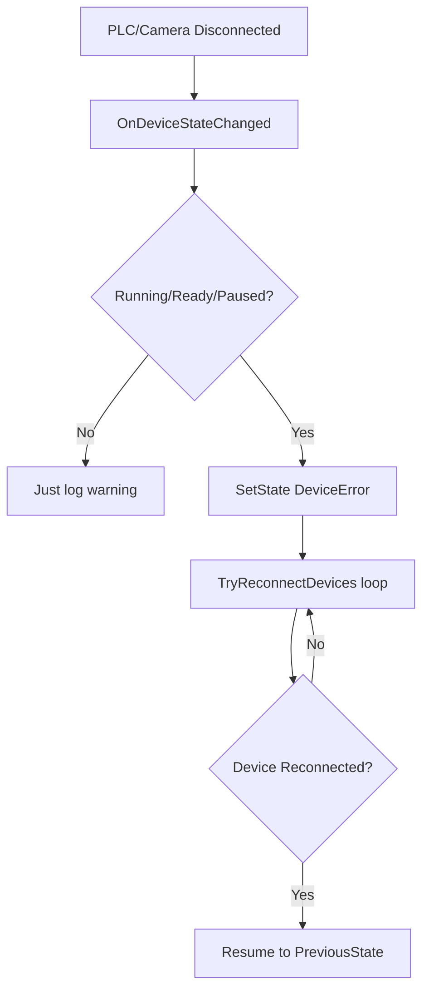

## Kế hoạch: Xử lý sự kiện mất kết nối thiết bị (Camera/PLC)

### Phân tích hiện trạng
- `e_ProductionState.DeviceError` đã tồn tại (line 61 trong `Enums.cs`)
- Case `DeviceError` ở line 602-603 hiện **trống** (chỉ có comment)
- `PLCMonitor` có event `StateChanged` nhưng **chưa subscribe** để chuyển state
- Camera callback xử lý `Disconnected`/`Reconnecting` nhưng **không làm gì**

### Cần thực hiện

#### 1. Thêm properties theo dõi trạng thái thiết bị
**File: `ProductionStateMachine.cs`**

```csharp
// Dòng ~65 (sau IsDeviceReady)
public bool IsAppReady { get; set; }
public bool IsDeviceReady { get; set; }
public string LastWarning { get; set; } = "";

// Thêm properties mới
public bool IsPLCConnected { get; private set; }
public bool IsCameraConnected { get; private set; }
public string DeviceDisconnectReason { get; private set; } = "";
```

#### 2. Cập nhật `Program.cs` - đăng ký event handler

**PLC StateChanged** (dòng ~76):
```csharp
_plcMonitor.StateChanged += (_, args) =>
{
    var (state, message) = args;
    ProductionStateMachine.Instance.OnDeviceStateChanged("PLC", state == PLCConnectionState.Connected, message);
    // ... existing broadcast code ...
};
```

**Camera Disconnected** (dòng ~124):
```csharp
case eOmronCodeReaderState.Disconnected:
    ProductionStateMachine.Instance.OnDeviceStateChanged("Camera", false, "Camera disconnected");
    break;
case eOmronCodeReaderState.Reconnecting:
    ProductionStateMachine.Instance.OnDeviceStateChanged("Camera", false, "Camera reconnecting...");
    break;
case eOmronCodeReaderState.Connected:
    ProductionStateMachine.Instance.OnDeviceStateChanged("Camera", true, "Camera connected");
    break;
```

#### 3. Thêm method xử lý device state trong StateMachine

**File: `ProductionStateMachine.cs`**

```csharp
public void OnDeviceStateChanged(string deviceName, bool isConnected, string message)
{
    lock (_stateLock)
    {
        if (deviceName == "PLC")
            IsPLCConnected = isConnected;
        else if (deviceName == "Camera")
            IsCameraConnected = isConnected;

        if (!isConnected)
        {
            DeviceDisconnectReason = $"{deviceName}: {message}";
            Log.Warning("[Device] {Device} disconnected: {Msg}", deviceName, message);

            // Chỉ chuyển sang DeviceError nếu đang ở trạng thái cần thiết bị
            if (CurrentState == e_ProductionState.Running || 
                CurrentState == e_ProductionState.Ready ||
                CurrentState == e_ProductionState.Paused)
            {
                SetState(e_ProductionState.DeviceError, DeviceDisconnectReason);
            }
        }
        else
        {
            Log.Information("[Device] {Device} reconnected", deviceName);
            DeviceDisconnectReason = "";
        }
    }
}
```

#### 4. Xử lý `DeviceError` state trong vòng lặp

**File: `ProductionStateMachine.cs`** (thay thế line 602-606):

```csharp
case e_ProductionState.DeviceError:
    // Log cảnh báo (có thể gửi notification/alert)
    if (!string.IsNullOrEmpty(DeviceDisconnectReason))
    {
        Log.Error("[DeviceError] {Reason}", DeviceDisconnectReason);
    }
    
    // Tự động thử reconnect (thay vì chờ user xử lý)
    TryReconnectDevices();
    break;
```

#### 5. Thêm method reconnect

```csharp
private void TryReconnectDevices()
{
    // Kiểm tra nếu thiết bị đã kết nối lại -> tự động resume
    if (IsPLCConnected && IsCameraConnected && !string.IsNullOrEmpty(DeviceDisconnectReason))
    {
        Log.Information("[DeviceError] All devices reconnected, resuming...");
        DeviceDisconnectReason = "";
        
        // Quay lại state trước đó hoặc Ready
        if (PreviousState == e_ProductionState.Running || 
            PreviousState == e_ProductionState.Paused)
        {
            SetState(PreviousState, "devices reconnected");
        }
        else
        {
            SetState(e_ProductionState.Ready, "devices reconnected");
        }
    }
}
```

### Luồng hoạt động


