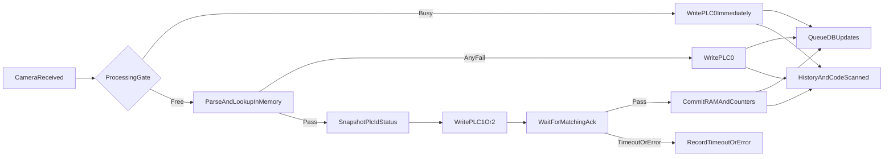

# Hoàn thiện luồng camera → PLC → DB/FE

## Quy tắc đã chốt
- PLC chỉ nhận `0 = Fail`; `1 = Pass/thùng lẻ`; `2 = Pass/thùng chẵn`.
- `Duplicate` là Fail và gửi `0`.
- Mỗi thời điểm chỉ xử lý một mã. Cờ bận được giữ đến khi PLC ACK hoặc timeout; mã đến trong lúc bận được gửi `0` ngay, không lookup/activate/đóng thùng.
- ACK dùng cơ chế V2: mặc định timeout `500 ms`, poll `10 ms`, đọc `PLC_CurrentID_DM_C2` và `PLC_CurrentStatus_DM_C2`; cấu hình được trong `AppConfig`.

## Luồng mục tiêu

## Thay đổi thực hiện

### 1. Sửa wiring và phân luồng camera
- Trong [`GProject/Program.cs`](GProject/Program.cs):
  - Khởi tạo duy nhất `Global.omronPLC` từ config trước khi camera/state machine có thể sử dụng; dùng chung địa chỉ `PLC_Reject_DM_C1` cho kết quả `0/1/2`.
  - Dùng IP/port camera trong `AppConfig` với fallback hiện tại thay vì hard-code hoàn toàn.
  - Thay `BackgroundWorker.IsBusy` bằng processing gate atomic + tác vụ nền: callback camera không bị block, không có race giữa kiểm tra bận và bắt đầu worker.
  - Với mã bận hoặc state không cho xử lý: ghi `0` trước; mã bận được ghi audit/đẩy FE dưới trạng thái lỗi nhưng tuyệt đối không vào lookup/activate.
  - Với mã được nhận xử lý: lấy `CameraReadResult`, ghi history và broadcast `CodeScanned`; luôn giải phóng gate trong `finally`.
- Chỉ cho pipeline nghiệp vụ chạy ở `Running`/`WaitingStop`, giữ đúng cấu trúc state hiện tại; các state khác chỉ phản hồi PLC `0`.

### 2. Viết lại trọn pipeline `HandleCodeFromCamera`
- Trong [`GProject/Production/ProductionStateMachine.cs`](GProject/Production/ProductionStateMachine.cs):
  - Đổi contract thành trả `CameraReadResult`; loại toàn bộ phần ghép dở hiện tại (`void` nhưng còn `return CameraReadResult`, helper đã mất, nhánh lỗi vẫn rơi xuống nhánh Pass).
  - Parse và trim payload `code|status`, dùng early return cho từng nhánh:
    - rỗng/`NO_READ` → `ReadFail` → PLC `0`;
    - sai cấu trúc/`REJECT` → `FormatError` → PLC `0`;
    - status lạ → `Error` → PLC `0`;
    - không có trong dictionary → `NotFound` → PLC `0`;
    - đã dùng → `Duplicate` → PLC `0`;
    - thiếu PO/thùng/state không hợp lệ → `Error` → PLC `0`.
  - Gom mọi ghi kết quả qua một helper an toàn dùng `MapResultForPLC`: chỉ `Pass` mới map lẻ `1`, chẵn `2`; mọi status còn lại map `0`. Kết quả write quyết định `PlcSent`/`PLCStatus` nhất quán.
  - Với ứng viên Pass: snapshot ID/status PLC, gửi `1/2` ngay sau lookup RAM, rồi poll ACK ngoài `_stateLock`. ACK phải cùng ID và đúng lane đã gửi; `3` là timeout; nếu ID đã nhảy thì đọc history PLC để resolve trước khi kết luận mất ACK.
  - Chỉ sau ACK Pass mới update dictionary, counter, thùng và enqueue DB. Write fail/ACK timeout không activate mã để mã còn có thể quét lại.
  - Sửa rollover thùng: mã vừa ACK vẫn trả `Pass` lên FE dù sau đó phải chuyển state sang `WaitCartonCode`; không biến một sản phẩm đã đi đúng làn thành `Error` trên dashboard.
  - Đồng bộ counter dưới lock; `Duplicate` và mọi non-Pass tăng `FailTotal`; bổ sung reset `FormatFailCount`.

### 3. Đảm bảo persistence không chặn phản hồi PLC
- Trong [`GProject/Production/ProductionStateMachine.cs`](GProject/Production/ProductionStateMachine.cs) và [`GProject/ProductionOrderHelpers/Models.cs`](GProject/ProductionOrderHelpers/Models.cs):
  - Snapshot `OrderNo`, production date, carton ID/code cùng kết quả scan để DB writer không vô tình ghi sang PO mới nếu state đổi trong lúc queue còn dữ liệu.
  - Ghi audit cho mọi kết quả đã xử lý, kể cả busy, malformed, duplicate, PLC write fail và ACK timeout.
  - Sau Pass ACK, DB writer tuần tự cập nhật `UniqueCodes`, record camera, DataPool `Used`, complete/start carton; chỉ đánh dấu DataPool sau khi PO update thành công.
  - Không làm SQLite/DataPool/AWS trong critical path camera; thêm retry có giới hạn cho lỗi SQLite tạm thời và drain queue an toàn khi shutdown để tránh dequeue rồi mất dữ liệu.

### 4. Hợp nhất backend về một PLC và hoàn thiện dashboard
- Trong [`GProject/GProjectApiServer.cs`](GProject/GProjectApiServer.cs): thay các tham chiếu stale tới `Program.GetPLCMonitor()`, `PLCMonitor` và `PLCHub` đã bị xóa bằng các read/write helper an toàn dùng chính `Global.omronPLC`; giữ các API device status/recipe/register hoạt động mà không tạo kết nối PLC thứ hai.
- Trong [`GProject/Configs/AppConfig.cs`](GProject/Configs/AppConfig.cs): thêm default `CameraAckTimeoutMs = 500` và `CameraAckPollIntervalMs = 10` có validation tối thiểu.
- Trong [`GProject/CameraHub.cs`](GProject/CameraHub.cs): serialize WebSocket sends để busy result và worker result không gọi `SendAsync` đồng thời trên cùng socket; history luôn nhận đúng status và cờ gửi PLC.
- Trong [`iot-scada-admin-panel/src/types/camera.ts`](iot-scada-admin-panel/src/types/camera.ts), [`iot-scada-admin-panel/src/types/production.ts`](iot-scada-admin-panel/src/types/production.ts), [`iot-scada-admin-panel/src/App.tsx`](iot-scada-admin-panel/src/App.tsx) và [`iot-scada-admin-panel/src/components/production/ProductionView.tsx`](iot-scada-admin-panel/src/components/production/ProductionView.tsx):
  - Bổ sung `FormatError`/`FormatFailCount`, badge đỏ “SAI ĐỊNH DẠNG”, lịch sử và counter dashboard tương ứng.
  - Bỏ luồng FE tự gọi `addFromReader` khi nhận raw `Received`; backend state machine là nguồn duy nhất được phép activate/update DataPool, tránh cập nhật DB trước ACK hoặc cập nhật hai lần.
  - Giữ `CodeScanned` làm event realtime; counter/thùng tiếp tục đồng bộ qua snapshot `/api/devices/status`.

## Kiểm chứng
- Build [`GProject/GProject.csproj`](GProject/GProject.csproj) và frontend; sửa toàn bộ compile/type/lint phát sinh do contract mới.
- Kiểm tra các case: `OK` thùng lẻ/chẵn, `REJECT`, `NO_READ`, payload sai, status lạ, NotFound, Duplicate, thiếu mã thùng, PLC write fail, ACK `1/2`, ACK `3`, ACK timeout/ID nhảy.
- Test burst: giữ mã đầu chờ ACK rồi gửi thêm mã; xác nhận mã sau nhận PLC `0`, không đổi `UniqueCodes`/DataPool/carton, nhưng có audit và badge FE.
- Đối chiếu sau Pass: RAM counter, PO DB, Record DB, DataPool, carton hiện tại/đóng thùng và dashboard phải cùng một kết quả; không có DB update trước ACK.