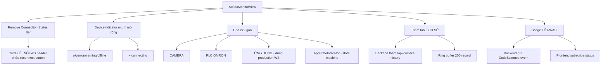

## Kế hoạch: Tinh chỉnh trang SCADA Monitor (iot-scada-admin-panel)

### Phạm vi thay đổi
- **Frontend**: `iot-scada-admin-panel/src/App.tsx`, file types, hooks
- **Backend (nhỏ)**: `GProject/Program.cs` (bổ sung status mã khi broadcast camera event)

---

### Phần 1: Loại bỏ Connection Status Bar trên cùng

**File: `iot-scada-admin-panel/src/App.tsx`** (dòng 502-536)

Xóa toàn bộ `<div className="flex items-center justify-between px-3 py-2 bg-white/80 backdrop-blur-sm rounded-2xl border border-slate-200/60 shadow-sm shrink-0">` (Connection Status Bar).

Nội dung "Đã kết nối Camera / Mất kết nối Camera", client count, ws URL và nút "Kết nối lại" sẽ được đưa vào header của Card "KẾT NỐI WEBSOCKET" (xem phần 2).

---

### Phần 2: Gộp vào Card "KẾT NỐI WEBSOCKET"

**File: `iot-scada-admin-panel/src/App.tsx`** (dòng 751-805)

Sửa `CardHeader` để nhận thêm phần action phía phải (status + nút reconnect). Tạo helper mới hoặc thêm prop vào `CardHeader`.

```tsx
const CardHeader = ({ title, icon: Icon, action }: {
  title: string;
  icon: React.ElementType;
  action?: React.ReactNode;
}) => (
  <div className="bg-slate-50/50 border-b border-slate-100 px-4 xl:px-5 2xl:px-6 py-2.5 xl:py-3 flex items-center justify-between shrink-0">
    <div className="flex items-center gap-2 xl:gap-2.5">
      <div className="p-1.5 rounded-lg bg-white shadow-sm ring-1 ring-slate-900/5 shrink-0">
        <Icon className="w-3.5 h-3.5 xl:w-4 xl:h-4 text-slate-600" strokeWidth={2.5} />
      </div>
      <span className="text-[10px] xl:text-xs 2xl:text-sm font-black tracking-wider text-slate-700 uppercase">{title}</span>
    </div>
    {action}
  </div>
);
```

Trong `ScadaMonitorView` truyền action cho Card "KẾT NỐI WEBSOCKET":

```tsx
<CardHeader
  title="KẾT NỐI WEBSOCKET"
  icon={Wifi}
  action={
    <button onClick={reconnect} className="...">
      <RefreshCw className={`w-3.5 h-3.5 ${!snapshot.connected ? "animate-spin" : ""}`} />
      Kết nối lại
    </button>
  }
/>
```

Đồng thời, 2 pill đầu trong card sửa lại thành 4 status (Camera WS + PLC WS) và thêm badge trạng thái TV cho mỗi WS.

---

### Phần 3: Sửa thẻ PLC và đồng bộ nhãn tiếng Việt

**File: `iot-scada-admin-panel/src/App.tsx`** (dòng 366-408 và 709-749)

#### 3.1 Thêm state `connecting` vào DeviceIndicator

```tsx
const DeviceIndicator = ({
  label,
  subLabel,
  icon: Icon,
  status,
}: {
  label: string;
  subLabel?: string;
  icon: React.ElementType;
  status: "ok" | "error" | "offline" | "warning" | "connecting";
}) => {
  const styles = {
    ok: "bg-green-50 text-green-700 border-green-100",
    error: "bg-red-50 text-red-700 border-red-100",
    warning: "bg-amber-50 text-amber-700 border-amber-100",
    connecting: "bg-blue-50 text-blue-700 border-blue-100",
    offline: "bg-slate-50 text-slate-600 border-slate-100",
  };
  const dotStyles = {
    ok: "bg-green-500 shadow-[0_0_8px_rgba(34,197,94,0.6)]",
    error: "bg-red-500 shadow-[0_0_8px_rgba(239,68,68,0.6)] animate-pulse",
    warning: "bg-amber-500 shadow-[0_0_8px_rgba(245,158,11,0.6)]",
    connecting: "bg-blue-500 shadow-[0_0_8px_rgba(59,130,246,0.6)] animate-pulse",
    offline: "bg-slate-400",
  };
  // ... phần render giữ nguyên
};
```

#### 3.2 Helper map trạng thái mới (có 3 trạng thái rõ ràng cho camera)

```tsx
const mapCameraStatus = (state: string | undefined, connected: boolean) => {
  if (!state) return "connecting";
  const s = state.toLowerCase();
  if (s === "connected" || s === "received") return "ok";
  if (s === "reconnecting") return "connecting";
  if (s === "disconnected" || s === "deactive") return "error";
  return "offline";
};

const mapPlcStatus = (connected: boolean, state: string | undefined) => {
  if (!connected && !state) return "connecting";
  if (!connected) return "connecting";
  const s = state?.toLowerCase();
  if (s === "disconnected") return "error";
  if (s === "reconnecting") return "connecting";
  return "ok";
};
```

#### 3.3 Helper format subLabel tiếng Việt

```tsx
const cameraLabelMap: Record<string, string> = {
  Connected: "Đã kết nối",
  Reconnecting: "Đang kết nối lại",
  Disconnected: "Mất kết nối",
  Received: "Đã kết nối", // nhận code = đang hoạt động
};

const cameraSubLabel = (state: string | undefined) => {
  if (!state) return "Đang kết nối";
  return cameraLabelMap[state] ?? state;
};
```

#### 3.4 Render các DeviceIndicator (sau khi loại bỏ WS CAMERA/WS PLC trùng lặp)

Xóa 2 instance `WS CAMERA` và `WS PLC`. Chỉ giữ 4 thẻ (grid 2x2):

```tsx
<DeviceIndicator
  icon={Monitor}
  label="CAMERA"
  subLabel={formatLastCode(snapshot.camera.lastCode, snapshot.camera.lastAt)}
  status={mapCameraStatus(cameraState, snapshot.connected)}
/>
<DeviceIndicator
  icon={Cpu}
  label="PLC OMRON"
  subLabel={plcSnapshot.ip
    ? `${plcSnapshot.ip}:${plcSnapshot.port ?? ""}`
    : cameraSubLabel(plcSnapshot.state)}
  status={mapPlcStatus(plcSnapshot.connected, plcSnapshot.state)}
/>
<DeviceIndicator
  icon={Settings}
  label="ỨNG DỤNG"
  subLabel={appStateLabel}
  status={appStateStatus}
/>
<AppStateIndicator ... /> // ô thứ 4 - hiển thị state production
```

#### 3.5 Cập nhật AppStateIndicator

Hiện tại chỉ có `Checking | Idle | Running | Error | NotUsed`. Mở rộng để cover đủ enum `e_ProductionState`:

```tsx
const stateConfig: Record<string, { label: string; bg: string; text: string; dot: string }> = {
  NeedLogin:    { label: "NEED LOGIN", ... },
  NoSelectedPO: { label: "NO PO", ... },
  Editing:      { label: "EDITING", ... },
  CheckingPO:   { label: "CHECKING PO", ... },
  Checking:     { label: "CHECKING", ... },
  CheckPO:      { label: "CHECK PO", ... },
  LoadPO:       { label: "LOAD PO", ... },
  Ready:        { label: "READY", ... },
  PushingToDic: { label: "LOADING DIC", ... },
  Running:      { label: "RUNNING", ... },
  Paused:       { label: "PAUSED", ... },
  CheckingQueue:{ label: "CHECK QUEUE", ... },
  Saving:       { label: "SAVING", ... },
  WaitingStop:  { label: "WAITING STOP", ... },
  CheckAfterCompleted: { label: "CHECK DONE", ... },
  Completed:    { label: "COMPLETED", ... },
  DeviceError:  { label: "DEVICE ERROR", bg: "bg-red-50 border-red-100", text: "text-red-700", dot: "bg-red-500 animate-pulse" },
  Error:        { label: "ERROR", bg: "bg-red-50 border-red-100", text: "text-red-700", dot: "bg-red-500 animate-pulse" },
};
```

---

### Phần 4: Nối "ỨNG DỤNG" với `/ws/production`

**File: `iot-scada-admin-panel/src/App.tsx`** (thêm vào `ScadaMonitorView`)

Thêm hook `useProductionWebSocket` để feed `AppStateIndicator`:

```tsx
const prodWsUrl = import.meta.env.VITE_PROD_WS_URL || "ws://localhost:9999/ws/production";
const { snapshot: prodSnapshot, connected: prodWsConnected } = useProductionWebSocket({
  url: prodWsUrl,
});

// Map trạng thái
const appStateLabel = prodWsConnected
  ? (prodSnapshot.state === "Unknown" ? "Idle" : prodSnapshot.state)
  : "Mất kết nối WS";

const appStateStatus = !prodWsConnected
  ? "connecting"
  : prodSnapshot.state === "Running" || prodSnapshot.state === "Ready"
    ? "ok"
    : prodSnapshot.state === "Error" || prodSnapshot.state === "DeviceError"
      ? "error"
      : "warning";
```

---

### Phần 5: Thêm tab lịch sử camera

**File: `iot-scada-admin-panel/src/App.tsx`** (dòng 446)

Mở rộng `activeTab`:

```tsx
const [activeTab, setActiveTab] = useState<"log" | "plc" | "error" | "history">("log");
```

Thêm button thứ 4 "LỊCH SỬ CAMERA".

#### 5.1 Backend: gửi kèm status mã

**File: `GProject/Program.cs`** (dòng 115-137)

Hiện tại `OnCameraEvent` chỉ forward event sang StateMachine. Cần lưu status mã (Pass/Duplicate/ReadFail/...) vào một bộ đệm trước khi broadcast.

Cách tiếp cận: thêm 1 ring buffer trong `CameraHub` (hoặc struct tĩnh) chứa 100 record gần nhất:

```csharp
// Trong CameraHub.cs hoặc Program.cs
public static readonly ConcurrentQueue<CameraHistoryEntry> RecentScans = new();
public record CameraHistoryEntry(string Id, DateTime At, string Code, string Status);
```

Trong `ProductionStateMachine.HandleCodeFromCamera` (file `GProject/Production/ProductionStateMachine.cs` dòng 298), sau khi xử lý được `e_ProductionStatus` (Pass/Duplicate/ReadFail/NotFound/Error), thêm dòng push vào queue:

```csharp
Program.CameraHistory.Record(code, status); // hàm static helper
```

`CameraHub.BroadcastAsync` cần bổ sung broadcast riêng cho event "HistoryUpdate", hoặc client tự gọi REST API `/api/camera-history` (đơn giản hơn).

#### 5.2 Frontend: fetch history khi mở tab

**File: `iot-scada-admin-panel/src/App.tsx`** (trong ScadaMonitorView)

```tsx
const [cameraHistory, setCameraHistory] = useState<CameraHistoryEntry[]>([]);

useEffect(() => {
  if (activeTab !== "history") return;
  fetch("/api/camera-history?limit=200")
    .then(r => r.json())
    .then(d => setCameraHistory(d.items ?? []))
    .catch(() => setCameraHistory([]));
}, [activeTab]);
```

#### 5.3 Render tab LỊCH SỬ

```tsx
{activeTab === "history" && (
  cameraHistory.length === 0 ? (
    <tr><td colSpan={5} className="...">Chưa có lịch sử...</td></tr>
  ) : (
    cameraHistory.map((entry) => {
      const statusColor = getStatusColor(entry.status);
      return (
        <tr key={entry.id}>
          <td>{entry.id}</td>
          <td>{new Date(entry.at).toLocaleString("vi-VN")}</td>
          <td><span className={`px-2 py-0.5 ... ${statusColor}`}>{entry.status}</span></td>
          <td className="font-mono">{entry.code}</td>
          <td>—</td>
        </tr>
      );
    })
  )
)}
```

---

### Phần 6: Cập nhật badge "TỐT" / "WAIT" hiển thị trạng thái mã

**File: `iot-scada-admin-panel/src/App.tsx`** (dòng 543-579)

Hiện badge chỉ phân biệt Connected/Disconnected. Cần lưu + hiển thị trạng thái mã vừa quét (Pass/Duplicate/ReadFail/...).

#### 6.1 Backend: đẩy status vào WS event

**File: `GProject/Program.cs`** (dòng 130)

Trước khi gọi `HandleCodeFromCamera`, hãy gọi `OnCameraCodeResult(...)` để gửi broadcast có status:

```csharp
case eOmronCodeReaderState.Received:
    var status = ProductionStateMachine.Instance.PeekLastCodeStatus(data);
    CameraHub.Instance.BroadcastCodeStatus(camera, data, status, DateTime.UtcNow);
    ProductionStateMachine.Instance.HandleCodeFromCamera(data);
    break;
```

Thêm method `PeekLastCodeStatus` vào `ProductionStateMachine` để trả về `e_ProductionStatus` (Pass/Error/Duplicate/...) sau khi xử lý.

#### 6.2 Frontend: subscribe event code status

**File: `iot-scada-admin-panel/src/types/camera.ts`**

```ts
export interface CameraCodeStatusMessage {
  camera: CameraName;
  state: "CodeScanned";
  data: string; // raw code
  status: "Pass" | "Duplicate" | "ReadFail" | "NotFound" | "Error" | "Unknown";
  at: string;
}

export type CameraState =
  | "Connected" | "Disconnected" | "Received" | "Reconnecting" | "CodeScanned";
```

**File: `iot-scada-admin-panel/src/hooks/useCameraSocket.ts`**

Trong `ws.onmessage`, nếu `data.state === "CodeScanned"` thì cập nhật snapshot riêng:

```tsx
const [lastScanStatus, setLastScanStatus] = useState<{ code: string; status: string; at: string } | null>(null);

ws.onmessage = (ev) => {
  const data = JSON.parse(ev.data);
  if (data.state === "CodeScanned") {
    setLastScanStatus({ code: data.data, status: data.status, at: data.at });
  }
  // ... xử lý cũ
};
```

#### 6.3 Render badge

```tsx
const scanResult = lastScanStatus; // { code, status, at }
const scanStateColor = scanResult?.status === "Pass"
  ? "from-green-500 to-emerald-600"
  : "from-red-500 to-rose-600";
const scanStateLabel = scanResult?.status === "Pass" ? "TỐT"
  : scanResult?.status === "Duplicate" ? "TRÙNG"
  : scanResult?.status === "ReadFail" ? "KHÔNG ĐỌC"
  : scanResult?.status === "NotFound" ? "KHÔNG CÓ"
  : scanResult?.status === "Error" ? "LỖI"
  : "WAIT";
```

Badge lớn đổi từ check camera connection → check code scan status. Vùng "Sự kiện camera gần nhất" hiển thị `scanResult.code` thay vì chỉ thời gian.

---

### Tóm tắt thay đổi



### Files cần sửa
- `iot-scada-admin-panel/src/App.tsx`
- `iot-scada-admin-panel/src/types/camera.ts`
- `iot-scada-admin-panel/src/types/plc.ts` (không cần)
- `iot-scada-admin-panel/src/types/production.ts` (kiểm tra)
- `GProject/Program.cs` (thêm broadcast CodeScanned)
- `GProject/Production/ProductionStateMachine.cs` (PeekLastCodeStatus, push history)
- `GProject/CameraHub.cs` (thêm method broadcastCodeStatus + ring buffer)
- Tạo mới `GProject/Controllers/CameraHistoryController.cs` (REST endpoint)