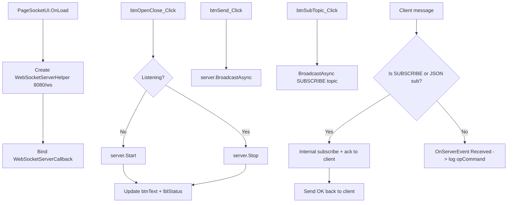

## Kế hoạch: WebSocketServer có hỗ trợ topic trên PageSocketUI

### Phạm vi hiện trạng
- `CLib/Interface/WebSocket/WebSocketServerHelper.cs` (594 dòng, namespace `TTManager.Communication.WebSocket`) đã có sẵn: `Start/Stop`, `BroadcastAsync`, `SendToClientAsync`, `DisconnectClient`, `GetConnectedClients`, callback `WebSocketServerCallback(WebSocketServerState, string)`. Có sẵn fallback `http://+` -> `http://localhost` khi thiếu quyền admin.
- `PageSocketUI` hiện chỉ là form trống với 4 control Sunny.UI: `btnOpenClose`, `btnSend`, `ipCommand` (UITextBox), `opCommand` (UIListBox). Đã được `MainForm` đăng ký làm tab 1002.
- `PageSocketUI.Designer.cs` đã được sinh sẵn, không cần sửa layout cơ bản. Nếu cần bổ sung control cho topic sẽ sửa Designer.
- `MainForm` đã giữ instance `pageSocketUI` ở field public; sẽ tận dụng cơ chế Sunny.UI page lifecycle (`OnLoad`, `OnClose`) thay vì can thiệp `MainForm`.

### 1. Kiểm tra thư viện WebSocketServerHelper

Rà soát logic trong [CLib/Interface/WebSocket/WebSocketServerHelper.cs](CLib/Interface/WebSocket/WebSocketServerHelper.cs) để phát hiện vấn đề trước khi dùng:

| Vấn đề tiềm ẩn | Mức độ | Hành động |
|---|---|---|
| `Start()` throw nếu fallback cũng lỗi; UI hiện tại chưa có cơ chế retry | Trung bình | Bọc try/catch + log vào `opCommand` (UI thread) |
| `SynchronizationContext.Current` được snapshot trong constructor -> nếu tạo ở thread không phải UI, callback sẽ chạy sai thread | Thấp | Tạo instance trong `OnLoad` của page (đã ở UI thread) |
| `Stop()` gọi callback `"Server stopped"` ngay sau khi đã `_httpListener?.Stop()`; lần `Start()` tiếp theo dùng lại `_listenerCts = null` nhưng `_serverCts` không được reset đồng bộ - đã OK vì cả hai đều set null | Không | Không cần sửa |
| `CleanupServer` dùng `Wait(cts.Token)` cho `CloseAsync` - có thể ném `OperationCanceledException` (đã có try/catch nuốt lỗi) | Không | Không cần sửa |
| Không có API publish theo topic | Thiếu | Bổ sung `SubscribeAsync(Guid, string)`, `UnsubscribeAsync(Guid, string)`, `SendToTopicAsync(string, string)` |
| Không có cơ chế auto-detect subscribe command | Thiếu | Trong vòng receive, nếu payload là lệnh subscribe/unsubscribe hợp lệ thì xử lý nội bộ, không forward ra callback |
| `Class1.cs` thừa, `CLib.csproj` thiếu reference giữa `CProject` và `CLib` | Trung bình | Cần thêm `ProjectReference CLib.csproj` vào `CProject.csproj`; `Class1.cs` có thể xóa nếu muốn gọn |

Quyết định: **không sửa sâu logic hiện có**, chỉ bổ sung phần topic và sửa những chỗ ảnh hưởng trực tiếp đến `PageSocketUI`. Mọi thay đổi đều backward-compatible.

### 2. Bổ sung API topic trong CLib

Sửa [CLib/Interface/WebSocket/WebSocketServerHelper.cs](CLib/Interface/WebSocket/WebSocketServerHelper.cs):

- Thêm `ConcurrentDictionary<Guid, ClientConnection>` mở rộng: giữ thêm `HashSet<string> Topics` (lowercase, trim).
- Thêm public API:
  ```csharp
  Task SubscribeAsync(Guid clientId, string topic);
  Task UnsubscribeAsync(Guid clientId, string topic);
  IReadOnlyCollection<string> GetTopics(Guid clientId);
  IReadOnlyDictionary<string, int> GetTopicStats(); // đếm client/topic
  Task<int> SendToTopicAsync(string topic, string data); // trả về số client đã gửi
  ```
- Trong vòng receive (hàm `HandleWebSocketAsync`):
  - Nếu `MessageType.Text` và payload khớp pattern `SUBSCRIBE <topic>` hoặc `UNSUBSCRIBE <topic>` -> gọi nội bộ Subscribe/Unsubscribe, trả về client text `OK sub <topic>` qua `SendToClientAsync`, KHÔNG forward ra callback `Received`.
  - Nếu payload là JSON `{"action":"subscribe","topic":"machine1"}` thì xử lý tương tự.
  - Các message khác vẫn forward ra callback `Received` như cũ.
- Đăng ký `ProjectReference` từ [CProject/CProject.csproj](CProject/CProject.csproj) tới `..\CLib\CLib.csproj`.

### 3. Triển khai UI trên PageSocketUI

Sửa [CProject/Views/PageSocketUI.Designer.cs](CProject/Views/PageSocketUI.Designer.cs) và [CProject/Views/PageSocketUI.cs](CProject/Views/PageSocketUI.cs).

**Bố cục (dựa trên Designer hiện có - bổ sung control mới, không phá cái cũ):**
- Hàng trên: `btnOpenClose` (text "Mở server" -> đổi thành "Đóng server" khi đang chạy), `lblStatus` (Sunny.UI UILabel) hiển thị `Port / Path / Client count`.
- Hàng dưới: `ipCommand` (giữ nguyên làm ô nhập lệnh broadcast), `btnSend` (broadcast), `txtTopic` (UITextBox mới - tên topic), `btnSubTopic` / `btnUnsubTopic` (2 nút mới).
- `opCommand` (UIListBox) giữ nguyên để log.
- (Tùy chọn) Thêm `dgvClients` (Sunny.UI UIDataGridView) bên phải để liệt kê clientId + danh sách topic đang subscribe - chỉ thêm nếu Designer cho phép; nếu quá phức tạp thì gom vào `opCommand` (chế độ "Other" trong câu hỏi trước là `opCommand_metadata`).

**Code-behind [PageSocketUI.cs](CProject/Views/PageSocketUI.cs):**

```text
- Override OnLoad:
    + Khởi tạo _server = new WebSocketServerHelper(8080, "/ws");
    + _server.WebSocketServerCallback += OnServerEvent;   // auto UI thread
    + Cập nhật lblStatus = "Stopped"; đổi text btnOpenClose = "Mở server";
- btnOpenClose_Click:
    + Nếu !Listening: _server.Start(); đổi text -> "Đóng server"; lblStatus -> "Listening :8080/ws";
    + Nếu Listening: _server.Stop(); đổi text -> "Mở server"; lblStatus -> "Stopped";
    + try/catch -> log lỗi vào opCommand.
- btnSend_Click (async):
    + Nếu ipCommand.Text rỗng -> return;
    + await _server.BroadcastAsync(ipCommand.Text); clear input;
- btnSubTopic_Click / btnUnsubTopic_Click:
    + Lấy topic từ txtTopic (trim, lowercase); nếu rỗng -> return;
    + Broadcast lệnh SUBSCRIBE/UNSUBSCRIBE tới tất cả client (hoặc chọn 1 client nếu sau này có dropdown):
        await _server.BroadcastAsync($"SUBSCRIBE {topic}");
    + Log "[Server] Sent SUBSCRIBE <topic>" vào opCommand.
- OnServerEvent(state, data):
    + Append timestamp + state + data vào opCommand (Items.Insert(0, ...) để mới nhất ở trên).
    + Refresh lblStatus nếu state là Connected/Disconnected (update ClientCount).
```

Thread safety: dựa vào `SynchronizationContext` đã snapshot trong constructor. Vì `OnLoad` chạy trên UI thread, callback sẽ tự post về UI thread - **không cần Invoke**.

### 4. Dọn dẹp

- Xóa [CLib/Class1.cs](CLib/Class1.cs) (placeholder rỗng) - thao tác một lần, không ảnh hưởng gì khác.
- Không sửa [Mte.sln](Mte.sln) - solution đã có cả `CProject` và `CLib` rồi.

### 5. Kiểm tra sau triển khai

- Build `dotnet build CProject/CProject.csproj` xem có lỗi reference/compile.
- Khi chạy app, mở tab `PageSocketUI`, bấm Mở server -> trạng thái đổi sang "Listening".
- Dùng `wscat -c ws://localhost:8080/ws/` (hoặc `examples/quick-test-client.js` có sẵn ở [DProject-Node-UPC-Server](DProject-Node-UPC-Server/examples/quick-test-client.js) làm tham khảo) gửi `SUBSCRIBE machine1` -> server log OK, sau đó `Send` "hello" từ UI -> chỉ client đã sub mới nhận.
- Test lỗi: cố tình bind 2 lần -> callback Error xuất hiện trong `opCommand`, app không crash.

### Luồng hoạt động

